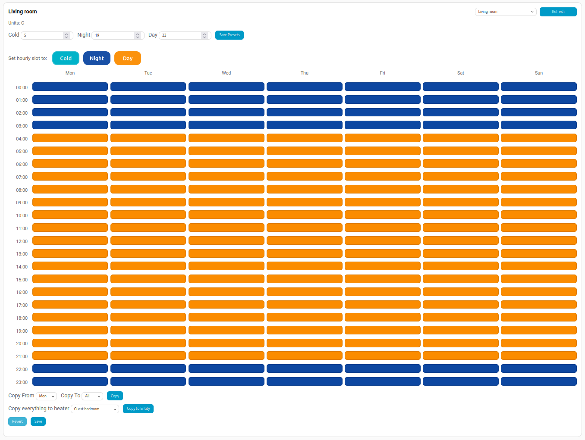

[](https://hacs.xyz/)


[](LICENSE)
[](https://github.com/ha-termoweb/ha-termoweb/releases)

[](https://github.com/ha-termoweb/ha-termoweb/actions/workflows/tests.yml)


[](https://docs.astral.sh/uv/)
[](https://docs.astral.sh/ruff/)


# TermoWeb heaters for Home Assistant

Control your **TermoWeb**, **Ducaheat**, or **Tevolve** electric heaters and thermostats in **Home Assistant** — from the HA app, automations, scenes, and voice assistants.

[](https://my.home-assistant.io/redirect/hacs_repository/?owner=ha-termoweb&repository=ha-termoweb&category=integration)
[](https://my.home-assistant.io/redirect/config_flow_start/?domain=termoweb)


> You must install the integration first (via HACS or manual copy) before the “Add integration” button will work.

---

## Who is this for?

For someone who runs Home Assistant and already uses the **TermoWeb**, **Tevolve** or **Ducaheat** mobile app to manage their electric heaters. They want to see and control those heaters in Home Assistant, use automations, and enable voice control. The manufacturer’s app doesn’t integrate with HA — this add-on provides the missing link.

---

## Brands using the TermoWeb app

These product lines are documented to work with the **TermoWeb** portal/app:

- **ATC (UK/Ireland)**: **Sun Ray Wifi** radiators with Wifi gateway. (**verified and fully working**)
- **S&P — Soler & Palau**: “**TermoWeb**” kits and **EMI-TECH TermoWeb** radiators.
- **Ecotermi / Linea Plus**: **Serie TermoWeb** radiators.
- **EHC — Electric Heating Company**: **eco SAVE** Smart Gateway kits that register on the TermoWeb portal.

> If a brand isn’t listed but the user signs in at **control.termoweb.net** (or **control2.termoweb.net**) with an app called **TermoWeb**, this integration should work.

## Ducasa with Ducaheat app.

Ducasa branded heaters (with the Ducaheat app), accumulators and other devices, are now supported with basic functionality tested and working. Heaters support temperature setting, weekly programming, switching modes (auto, manual, off). Preliminary support for "boost" on accumulators is currently in testing. Energy and power readings are also in testing with some basic support. Work is ongoing with full support expected before the end of the year. 

## Tevolve app (Ducaheat backend)

Tevolve-branded heaters use the same backend as the Ducaheat app. If you manage your heaters in the **Tevolve** mobile app or on the **Tevolve** website, select **Tevolve** in the brand picker and this integration will connect using the Ducaheat backend automatically.

---

## What you can do in Home Assistant

- Turn heaters and thermostats **On/Off** and set **target temperature**.
- Choose **Auto** or **Manual** mode.
- See live room temperature and heating state (every heater is also a temperature sensor)
- View and change the weekly schedule and temperature presets
- See cumulative energy use and import energy use history from TermoWeb.
- Add energy sensors to the HA energy dashboard so you can see current and historical use/cost.
- Monitor thermostat battery level so you know when wireless controllers need attention.
- Track accumulator charging status and charge targets to understand storage heater behaviour.
- Use HA **automations**, **scenes**, and **voice assistants** (including HA’s Google/Alexa integrations).

### Climate mode behavior (important)

Use these rules when changing heater temperature in Home Assistant:

1) If the heater is in **Auto** and you change the target temperature, Home Assistant sends a **temporary override**.
2) That temporary override runs until the next weekly program time slot starts.
3) After that, the heater returns to the normal weekly **Auto** program temperature.
4) The heater switches to **Manual/Heat** only when you explicitly select **Heat** (manual) mode in Home Assistant.

If your dashboard shows a preset label, **temporary override** means: “Use this manual target now, but only until the next scheduled program change.”

---

## What you’ll need

- A working TermoWeb setup (gateway connected to the router, heaters paired).
- The **TermoWeb account email & password** (the same used in the mobile app / web).
- Home Assistant (Core, OS, or Container) with internet access.

---

## The bad news

- This integration is **Internet dependent**, as all interaction with heaters is mediated by the cloud backend. This is not ideal, as part of the HA ethos is local data and control. Unfortunately, we cannot connect directly to the Wifi gateways that are in your home, as they are proprietary and a "black box".

---

## Install (simple, step-by-step)

### Option A — HACS (recommended)

1) Open **HACS → Integrations** in Home Assistant.  
2) Click **⋮** (top-right) → **Custom repositories** → **Add**.  
3) Paste: `https://github.com/ha-termoweb/ha-termoweb` and choose **Integration**.  
   Or click:  
   [](https://my.home-assistant.io/redirect/hacs_repository/?owner=ha-termoweb&repository=ha-termoweb&category=integration)  
4) Search for **TermoWeb** in HACS and **Install**.  
5) **Restart Home Assistant** when prompted.

### Option B — Manual

1) Download this repository.  
2) Copy the folder **`custom_components/termoweb`** to **`<config>/custom_components/termoweb`** on the HA system.  
3) **Restart Home Assistant**.

---

## Set up the integration
ha-termoweb/ha-termoweb
1) In Home Assistant go to **Settings → Devices & Services → Add Integration** and search **TermoWeb**,
   or click:
   [](https://my.home-assistant.io/redirect/config_flow_start/?domain=termoweb)
2) Choose your **Brand**. This picks the correct backend automatically, so you do **not** need to enter a portal URL manually.
3) Enter the account **Email** used for the TermoWeb / Ducaheat / Tevolve app.
4) Enter the account **Password**.
5) Complete the wizard. Heaters will appear under **Devices**; add them to dashboards or use them in automations.
6) Copy the custom card for a dashboard element that allows you to program presets and weekly schedule across heaters. 
---

## Tips
- **Voice control:** Expose heater entities via Home Assistant’s Google or Alexa integrations.
- **Automations idea:** Lower temperature when nobody’s home; switch to **Off** if a window sensor is open for 10+ minutes.

## Install custom weekly schedule card

See instructions in custom_components/termoweb/assets, to install the card and create a dashboard with weekly programming like this:




## Energy monitoring & history
- Each heater provides an **Energy** sensor in kWh and the integration adds a **Total Energy** sensor aggregating all heaters.
- Add these sensors in **Settings → Dashboards → Energy** to include them in Home Assistant’s Energy Dashboard.
- Live energy samples now arrive via the websocket connection, with the hourly
  REST poll remaining as a fallback if the push feed is unavailable.
- Use the `termoweb.import_energy_history` service (Developer Tools → Services) to backfill past consumption after installing the integration. The service always refreshes every configured TermoWeb node and reconciles all samples through the current minute with any existing statistics.
- No extra configuration is required beyond selecting the sensors in the Energy Dashboard.

---

## Troubleshooting

- **Login fails:** First confirm credentials at the TermoWeb website (control.termoweb.net / control2.termoweb.net).
- **No devices found:** Check the **gateway** is powered and online (LEDs), and that the manufacturer app shows heaters online.
- **Slow reconnect after errors:** Websocket retries are rate limited to protect the backend. A brief pause between attempts is
  expected after any outage.
- **Collect diagnostics:** In **Settings → Devices & Services → TermoWeb → ⋮**, choose **Download diagnostics** to save an anonymised report (integration/Home Assistant versions, backend brand, node inventory). Attach that JSON file when opening an issue so we can reproduce problems faster.
- **Need help?** Open a GitHub issue with brand/model and a brief description. **Never share passwords or private info.**

---

## Privacy & Security

- Credentials stay in Home Assistant.  
- Access tokens are **redacted** from logs.
- This project is **not affiliated** with S&P, ATC, Ecotermi/Linea Plus, EHC, or TermoWeb.

---

## Development

Setup your environment:

```bash
uv venv -p 3.13
uv pip install --all-extras -r pyproject.toml -p 3.13
```

Run tests with coverage:

```bash
timeout 60s uv run pytest --cov=custom_components/termoweb --cov-report=term-missing
```

See [`docs/developer-notes.md`](docs/developer-notes.md) for backend write semantics and other
implementation details for contributors.

---

## Debugging and Logs

See DEBUG.md for information on how to turn on debugging, and download logs and diagnostics.


## Search keywords

*Home Assistant TermoWeb, TermoWeb heaters Home Assistant, ATC radiators, S&P TermoWeb Home Assistant, Soler & Palau TermoWeb, Ecotermi TermoWeb, Linea Plus TermoWeb, Electric Heating Company eco SAVE Home Assistant, eco SAVE Smart Gateway Home Assistant*
