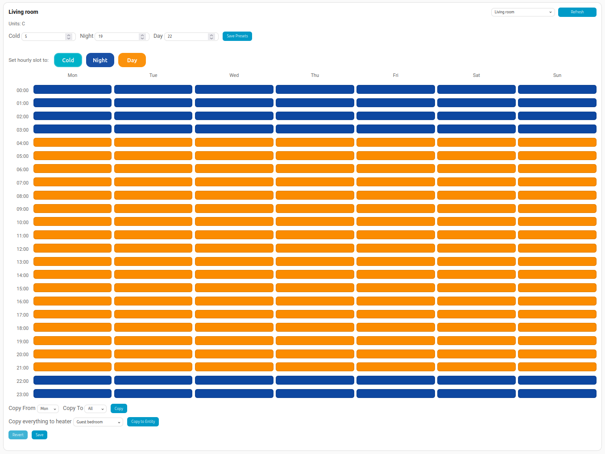

[](https://hacs.xyz/)


[](LICENSE)
[](https://github.com/ha-termoweb/ha-termoweb/releases)

[](https://github.com/ha-termoweb/ha-termoweb/actions/workflows/tests.yml)


[](https://docs.astral.sh/uv/)
[](https://docs.astral.sh/ruff/)


# TermoWeb heaters for Home Assistant

Control your **TermoWeb**, **Ducaheat**, or **Tevolve** electric heaters and thermostats in **Home Assistant** — from the HA app, automations, scenes, and voice assistants.

[](https://my.home-assistant.io/redirect/hacs_repository/?owner=ha-termoweb&repository=ha-termoweb&category=integration)
[](https://my.home-assistant.io/redirect/config_flow_start/?domain=termoweb)


> You must install the integration first (via HACS or manual copy) before the “Add integration” button will work.

---

## Who is this for?

For someone who runs Home Assistant and already uses the **TermoWeb**, **Tevolve** or **Ducaheat** mobile app to manage their electric heaters. They want to see and control those heaters in Home Assistant, use automations, and enable voice control. The manufacturer’s app doesn’t integrate with HA — this add-on provides the missing link.

---

## Brands using the TermoWeb app

These product lines are documented to work with the **TermoWeb** portal/app:

- **ATC (UK/Ireland)**: **Sun Ray Wifi** radiators with Wifi gateway. (**verified and fully working**)
- **S&P — Soler & Palau**: “**TermoWeb**” kits and **EMI-TECH TermoWeb** radiators.
- **Ecotermi / Linea Plus**: **Serie TermoWeb** radiators.
- **EHC — Electric Heating Company**: **eco SAVE** Smart Gateway kits that register on the TermoWeb portal.

> If a brand isn’t listed but the user signs in at **control.termoweb.net** (or **control2.termoweb.net**) with an app called **TermoWeb**, this integration should work.

## Ducasa with Ducaheat app.

Ducasa branded heaters (with the Ducaheat app), accumulators and other devices, are now supported with basic functionality tested and working. Heaters support temperature setting, weekly programming, switching modes (auto, manual, off). Preliminary support for "boost" on accumulators is currently in testing. Energy and power readings are also in testing with some basic support. Work is ongoing with full support expected before the end of the year. 

## Tevolve app (Ducaheat backend)

Tevolve-branded heaters use the same backend as the Ducaheat app. If you manage your heaters in the **Tevolve** mobile app or on the **Tevolve** website, select **Tevolve** in the brand picker and this integration will connect using the Ducaheat backend automatically.

---

## What you can do in Home Assistant

- Turn heaters and thermostats **On/Off** and set **target temperature**.
- Choose **Auto** or **Manual** mode.
- See live room temperature and heating state (every heater is also a temperature sensor)
- View and change the weekly schedule and temperature presets
- See cumulative energy use and import energy use history from TermoWeb.
- Add energy sensors to the HA energy dashboard so you can see current and historical use/cost.
- Monitor thermostat battery level so you know when wireless controllers need attention.
- Track accumulator charging status and charge targets to understand storage heater behaviour.
- Use HA **automations**, **scenes**, and **voice assistants** (including HA’s Google/Alexa integrations).

### Climate mode behavior (important)

Use these rules when changing heater temperature in Home Assistant:

1) If the heater is in **Auto** and you change the target temperature, Home Assistant sends a **temporary override**.
2) That temporary override runs until the next weekly program time slot starts.
3) After that, the heater returns to the normal weekly **Auto** program temperature.
4) The heater switches to **Manual/Heat** only when you explicitly select **Heat** (manual) mode in Home Assistant.

If your dashboard shows a preset label, **temporary override** means: “Use this manual target now, but only until the next scheduled program change.”

---

## What you’ll need

- A working TermoWeb setup (gateway connected to the router, heaters paired).
- The **TermoWeb account email & password** (the same used in the mobile app / web).
- Home Assistant **2026.10.0 or newer** (Core, OS, or Container) with internet access. HACS will not install the integration on an older version. Update Home Assistant first.

---

## The bad news

- This integration is **Internet dependent**, as all interaction with heaters is mediated by the cloud backend. This is not ideal, as part of the HA ethos is local data and control. Unfortunately, we cannot connect directly to the Wifi gateways that are in your home, as they are proprietary and a "black box".

---

## Install (simple, step-by-step)

### Option A — HACS (recommended)

1) Open **HACS → Integrations** in Home Assistant.  
2) Click **⋮** (top-right) → **Custom repositories** → **Add**.  
3) Paste: `https://github.com/ha-termoweb/ha-termoweb` and choose **Integration**.  
   Or click:  
   [](https://my.home-assistant.io/redirect/hacs_repository/?owner=ha-termoweb&repository=ha-termoweb&category=integration)  
4) Search for **TermoWeb** in HACS and **Install**.  
5) **Restart Home Assistant** when prompted.

### Option B — Manual

1) Download this repository.  
2) Copy the folder **`custom_components/termoweb`** to **`<config>/custom_components/termoweb`** on the HA system.  
3) **Restart Home Assistant**.

---

## Set up the integration
ha-termoweb/ha-termoweb
1) In Home Assistant go to **Settings → Devices & Services → Add Integration** and search **TermoWeb**,
   or click:
   [](https://my.home-assistant.io/redirect/config_flow_start/?domain=termoweb)
2) Choose how your heaters connect:
   - **Cloud account**: you use the TermoWeb, Ducaheat or Tevolve app. Go to step 3.
   - **Local radio gateway**: you built the ESP32 radio gateway. Follow
     [Radio gateway: build your own with an ESP32](docs/radio_gateway.md), step 5, then go to step 6.
   - **Local radio: nanoCUL USB stick**: you have a nanoCUL plugged into the Home Assistant computer.
     Follow [Radio stick: use a nanoCUL USB stick](docs/radio_nanocul.md), step 3, then go to step 6.
3) Choose your **Brand**. This picks the correct backend automatically, so you do **not** need to enter a portal URL manually.
4) Enter the account **Email** used for the TermoWeb / Ducaheat / Tevolve app.
5) Enter the account **Password**.
6) Complete the wizard. Heaters will appear under **Devices**; add them to dashboards or use them in automations.
7) Copy the custom card for a dashboard element that allows you to program presets and weekly schedule across heaters. 
---

## After the upgrade (2026-10 release)

What changed, and what you need to do:

- **Home Assistant 2026.10.0 or newer is required.** Update Home Assistant first, then update the integration in HACS. Restart Home Assistant when asked.
- **Your entities are kept.** On the first start, the integration moves all entities to one new ID scheme by itself. Entity IDs (for example `climate.living_room`), history, names, areas and dashboards stay the same. You do not need to do anything.
- **One unavailable duplicate?** Some people have an old, unavailable entity left over from version 2.3.0 (for example a second **Installation info** sensor). Delete the one that shows **unavailable**:
  1. Go to **Settings → Devices & Services → Entities**.
  2. Search for the name, for example `installation info`.
  3. Open the entity that says **unavailable** or **no longer provided by the integration**.
  4. Click the **gear** icon, then **Delete**.
  Keep the entity that has a value.
- **Temperatures in °F** are now shown correctly for devices that use Fahrenheit.
- **Turn on and turn off** now work from the climate card, automations and voice assistants.
- **Unavailable when the cloud is down.** If the TermoWeb cloud cannot be reached, your entities show **unavailable** instead of old values. They come back by themselves when the cloud is back.
- **Boost (accumulators).** Boost can last 60 to 600 minutes (in steps of 60). The boost buttons work again. The boost duration and boost temperature numbers now save to the device.
- **Removed:** the `ws_debug_probe` action and the **debug** option. To collect logs, see [DEBUG.md](DEBUG.md).

### Your password changed

If you change your password in the TermoWeb, Ducaheat or Tevolve app, Home Assistant cannot sign in any more. Then:

1. Open **Settings → Devices & Services**. The TermoWeb card asks you to sign in again. A message also appears in **Settings → Repairs**.
2. Click it and enter the **new password**.
3. The integration reloads by itself. You do not need to remove it.

Changing the settings with **⋮ → Reconfigure** also reloads the integration for you.

### One account, one entry

You can add each account only once. The same email on **Ducaheat** and **Tevolve** counts as the same account, because both use the Ducaheat backend. Upper and lower case in the email do not matter. If you try to add it again, Home Assistant says it is already configured.

### Why the integration is careful with the cloud

The cloud is shared by many users. To protect it, the integration:

- uses the **WebSocket** (live push) for updates once it has started. It asks the cloud over REST only when the WebSocket is not available.
- sends at most **2 cloud requests per second**, also during the energy history import.
- waits a short time before it tries to reconnect after an outage.

Please do not add automations that call the cloud very often.

---

## Tips
- **Voice control:** Expose heater entities via Home Assistant’s Google or Alexa integrations.
- **Automations idea:** Lower temperature when nobody’s home; switch to **Off** if a window sensor is open for 10+ minutes.

## Install custom weekly schedule card

See instructions in custom_components/termoweb/assets, to install the card and create a dashboard with weekly programming like this:




## Energy monitoring & history
- Each heater provides an **Energy** sensor in kWh and the integration adds a **Total Energy** sensor aggregating all heaters.
- Add these sensors in **Settings → Dashboards → Energy** to include them in Home Assistant’s Energy Dashboard.
- Live energy samples now arrive via the websocket connection, with the hourly
  REST poll remaining as a fallback if the push feed is unavailable.
- Use the `termoweb.import_energy_history` action (Developer Tools → Actions) to add past consumption after installing the integration. **Run it once.** Most people never need to run it again.
  1. Set **Max history days** to how far back you want (1 to 3650, default 7).
  2. Run the action. It imports every heater, accumulator and power monitor that has an energy sensor. It asks the cloud for one day per request, at most 2 requests per second, so a year for 3 heaters takes about 10 minutes. Do not start it twice. A second run while one is active stops with "already running".
  3. If it stops with an error, run it again later. It continues where it stopped.
  4. To get more days later, run it again with a bigger number. Only the missing older days are fetched.
  5. To import the whole period again, turn on **Reset progress**. The old statistics are overwritten in place. Nothing is deleted.
- What you will see: in **Settings → Dashboards → Energy**, the past days fill in with hourly values. The totals continue without a jump at the point where the import ends. The numbers can take a few minutes to show after the import ends.
- No extra configuration is required beyond selecting the sensors in the Energy Dashboard.

---

## Troubleshooting

- **Login fails:** First confirm credentials at the TermoWeb website (control.termoweb.net / control2.termoweb.net).
- **No devices found:** Check the **gateway** is powered and online (LEDs), and that the manufacturer app shows heaters online.
- **Slow reconnect after errors:** Websocket retries are rate limited to protect the backend. A brief pause between attempts is
  expected after any outage.
- **Login fails after a password change:** See **Your password changed** above.
- **Entities show unavailable:** The cloud may be down, or your gateway is offline. Check the manufacturer app. They return by themselves.
- **Collect diagnostics:** In **Settings → Devices & Services → TermoWeb → ⋮**, choose **Download diagnostics** to save an anonymised report (integration/Home Assistant versions, backend brand, node inventory; account, gateway id and location are removed). Attach that JSON file when opening an issue so we can reproduce problems faster.
- **Need help?** Open a GitHub issue with brand/model and a brief description. **Never share passwords or private info.**

---

## Privacy & Security

- Credentials stay in Home Assistant.  
- Access tokens are **redacted** from logs.
- This project is **not affiliated** with S&P, ATC, Ecotermi/Linea Plus, EHC, or TermoWeb.

---

## Development

Setup your environment:

```bash
uv sync --locked --extra test
```

There are two test suites. Run them one after the other. The second run adds its
coverage to the first, and the 90% coverage gate applies to the total:

```bash
# 1. Older tests, using a stub of Home Assistant (folder tests/)
timeout 60s uv run pytest --cov --cov-fail-under=0 --cov-report=
# 2. Tests against the real Home Assistant (folder tests_ha/)
timeout 60s uv run pytest tests_ha -p homeassistant -o asyncio_mode=auto --cov --cov-append
```

The two suites must run as separate commands. The stub in `tests/conftest.py`
replaces Home Assistant for the whole test run, so it cannot share a run with the
real one. Write new tests in `tests_ha/`. Old tests move there step by step.

See [`docs/developer-notes.md`](docs/developer-notes.md) for backend write semantics and other
implementation details for contributors.

---

## Debugging and Logs

See DEBUG.md for information on how to turn on debugging, and download logs and diagnostics.


## Search keywords

*Home Assistant TermoWeb, TermoWeb heaters Home Assistant, ATC radiators, S&P TermoWeb Home Assistant, Soler & Palau TermoWeb, Ecotermi TermoWeb, Linea Plus TermoWeb, Electric Heating Company eco SAVE Home Assistant, eco SAVE Smart Gateway Home Assistant*
