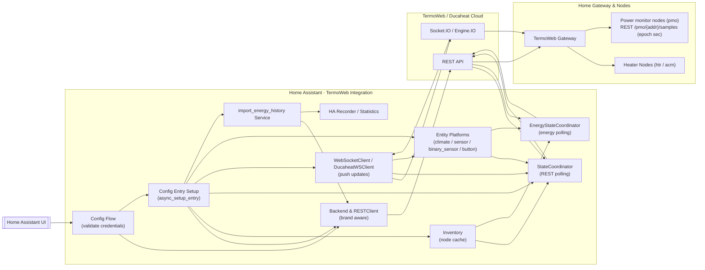
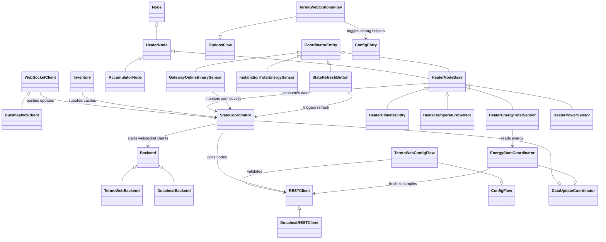

# HA-TermoWeb Architecture Overview

The TermoWeb integration links Home Assistant to both the TermoWeb and Ducaheat
deployments of the vendor cloud. Authentication, device discovery and write
operations flow through brand-specific REST clients, while push updates and
connection health are maintained through websocket clients that the backend
constructs for each gateway. Home Assistant maintains per-installation caches of
nodes, coordinates REST polling, merges websocket deltas, and exposes entity
state and energy statistics to the rest of the platform.【F:custom_components/termoweb/__init__.py†L140-L233】【F:custom_components/termoweb/backend/ws_client.py†L77-L193】【F:custom_components/termoweb/backend/ducaheat_ws.py†L188-L386】【F:custom_components/termoweb/energy.py†L421-L512】

## Inventory-centric design

The integration treats the gateway and node inventory as an immutable contract
that is captured once during setup. Each config entry normalises the raw payload
into an `Inventory` stored inside `hass.data`, allowing coordinators, websocket
clients and services to reuse the same canonical metadata without repeating
discovery calls.【F:custom_components/termoweb/__init__.py†L331-L405】【F:custom_components/termoweb/inventory.py†L86-L170】

Inventory helpers provide cached views for node type groupings, heater address
maps and naming metadata so downstream consumers never mutate the raw payload.
Coordinators rely on these cached structures to derive polling targets, websocket
subscriptions and UI naming hints while assuming that the set of devices and
addresses remains stable across the lifetime of the entry. When hardware changes
are required, users are expected to reload the integration so a fresh inventory is
captured from the backend.【F:custom_components/termoweb/inventory.py†L138-L236】【F:custom_components/termoweb/__init__.py†L320-L411】

Power monitors (`pmo`) ride alongside heaters in the captured `dev_data`
snapshot. The snapshot also exposes a `pmo_system` block with global power
management metadata such as `main_circuit_pmos` plus the `max_power_config`
profiles and slots observed in captures. Inventory caches persist these nodes
even though the integration only reads them today so future entities inherit the
discover-once contract.【F:docs/ducaheat_api.md†L27-L33】【F:custom_components/termoweb/inventory.py†L181-L323】
The heater caches now have power-monitor siblings so websocket rebuilds retain
forward/reverse address maps, compatibility aliases (covering legacy
`power_monitor` keys) and subscription tuples alongside the heater metadata the
coordinators already consume.【F:custom_components/termoweb/inventory.py†L181-L323】

## Key components

- **Config flow** – collects credentials, preferred brand and polling interval,
  instantiates a REST client for validation, and blocks entry creation until the
  remote account responds to a `list_devices` probe.【F:custom_components/termoweb/config_flow.py†L41-L177】
- **Config entry setup** – rebuilds the REST client, selects the appropriate
  backend implementation, snapshots the gateway and node inventory, prepares the
  `StateCoordinator`, and starts websocket clients before forwarding platforms
  and registering the energy import service.【F:custom_components/termoweb/__init__.py†L140-L233】
- **Backend abstractions** – the `Backend` interface exposes a shared HTTP
  client and a `create_ws_client` factory. `TermoWebBackend` reuses the unified
  websocket client, whereas `DucaheatBackend` injects an Engine.IO-compatible
  variant alongside the `DucaheatRESTClient` adapter that reshapes segmented API
  endpoints and websocket payloads.【F:custom_components/termoweb/backend/base.py†L11-L98】【F:custom_components/termoweb/backend/termoweb.py†L14-L69】【F:custom_components/termoweb/backend/ducaheat.py†L19-L190】【F:custom_components/termoweb/backend/ducaheat.py†L503-L529】
- **Inventory helpers** – `inventory.py` normalises raw payloads into immutable
  node objects, exposes cached heater and power monitor metadata, and provides
  resolver utilities that rebuild cached inventories for coordinators, websocket
  handlers and services.【F:custom_components/termoweb/inventory.py†L86-L340】
- **Data coordinators** – `StateCoordinator` polls heater settings, maintains
  node caches and stretches polling intervals when websocket health is good,
  while `EnergyStateCoordinator` tracks address subscriptions, derives power
  deltas from hourly counters and suppresses REST polling when fresh websocket
  samples arrive.【F:custom_components/termoweb/coordinator.py†L93-L745】
- **Entity platforms** – `HeaterNodeBase` wires coordinator caches and
  dispatcher callbacks into climate and sensor entities; climate, temperature,
  energy and power entities extend this base to expose heater control and
  telemetry. Installation-wide aggregation, gateway connectivity monitoring and
  refresh buttons round out the platform coverage.【F:custom_components/termoweb/heater.py†L374-L520】【F:custom_components/termoweb/climate.py†L134-L220】【F:custom_components/termoweb/sensor.py†L156-L337】【F:custom_components/termoweb/sensor.py†L345-L421】【F:custom_components/termoweb/binary_sensor.py†L21-L99】【F:custom_components/termoweb/button.py†L21-L67】
- **Boost helpers** – Accumulator nodes surface a dedicated preset workflow:
  `HeaterClimateEntity` exposes `preset_modes` with a synthetic `boost` entry,
  paired number helpers offer slider controls for duration and temperature
  presets, the lone start button loads the persisted values before invoking the
  boost service, and binary/sensor entities reflect the active state and
  expected end time.【F:custom_components/termoweb/climate.py†L982-L1269】【F:custom_components/termoweb/number.py†L1-L235】【F:custom_components/termoweb/button.py†L39-L330】【F:custom_components/termoweb/binary_sensor.py†L42-L99】【F:custom_components/termoweb/sensor.py†L146-L461】
- **Websocket layer** – `WebSocketClient` negotiates the correct Socket.IO or
  Engine.IO handshake, keeps per-device health metrics, updates coordinator
  caches, and broadcasts dispatcher signals. `DucaheatWSClient` layers brand-
  specific logging atop the shared implementation.【F:custom_components/termoweb/backend/ws_client.py†L40-L193】【F:custom_components/termoweb/backend/ducaheat_ws.py†L188-L386】
- **Energy services** – the energy helper enforces a shared rate limiter for
  historical sample queries, iterates the immutable inventory to import every
  node's history, and registers the `import_energy_history` service only once
  per Home Assistant instance.【F:custom_components/termoweb/energy.py†L150-L177】【F:custom_components/termoweb/energy.py†L344-L523】【F:custom_components/termoweb/energy.py†L720-L774】

- **Power monitor coverage** – `pmo` nodes are discovered from `dev_data`, expose read payloads via `/pmo/{addr}`
  and energy counters via `/pmo/{addr}/samples`. No WebSocket `status` deltas are observed, so consumers must poll REST or fetch
  samples when updated limits or counters are required.【F:docs/ducaheat_api.md†L154-L181】

## Runtime data flow



Power monitor energy counters flow exclusively through REST reads and `/pmo/{addr}/samples` requests using epoch-second windows; no WebSocket deltas supplement these feeds today.【F:docs/ducaheat_api.md†L154-L181】 Inventory rebuilds reuse the cached address maps so entity display names and compatibility aliases persist even if websocket clients need to reconstruct their snapshot state.

## Ducaheat selection & boost pipeline

### Components

- **REST client** — issues mandatory `select` claims and the subsequent `/boost` writes for accumulator nodes.
- **WebSocket client** — subscribes to `/api/v2/socket_io` and relays `update` + `dev_data` events to the coordinator.
- **Coordinator** — serialises selection, orchestrates retries, and merges WebSocket deltas into Home Assistant state.
- **UI layer** — exposes slider controls for the boost duration (1–10 hours) and setpoint (5–30 °C) so presets stay in sync with Home Assistant.

### HTTP data contracts

- `POST /api/v2/devs/{dev_id}/{type}/{addr}/select` — body `{ "select": true|false }`, response `201 {}`.
- `POST /api/v2/devs/{dev_id}/{type}/{addr}/boost` — start with `{ "boost": true, "boost_time": <60-600>, "stemp": "##.#", "units": "C|F" }`; stop with `{ "boost": false }`. Requires an active selection claim.

### WebSocket contract

Representative payload emitted after a successful write:

```json
{
  "path": "/{type}/{addr}/status",
  "body": {
    "boost": true,
    "boost_end_day": 0,
    "boost_end_min": 945,
    "stemp": "7.5",
    "units": "C"
  }
}
```

### HA entity mapping

- **Controls:** Boost duration and setpoint sliders constrained to **1–10 hours (60–600 minutes)** and **5–30 °C** respectively.
- **Helpers:** Single **Start boost** button pulls the stored duration and temperature presets before invoking the boost service.
- **Attributes:** expose `boost`, `boost_end_day`, `boost_end_min`, `stemp`, and `units` so dashboards mirror cloud state.
- **Defaults:** cache `/setup` values (`extra_options.boost_time`, `boost_temp`) to pre-populate selectors without toggling Boost directly.

### Services

- `termoweb.select_node(dev_id, type, addr, select: bool)`
- `termoweb.start_boost(dev_id, type, addr, minutes: 60..600, stemp: '##.#', units: 'C|F')`
- `termoweb.stop_boost(dev_id, type, addr)`

### Control flow

1. Issue `select: true` and wait for `201 {}`.
2. Call `/boost` to start or stop Boost.
3. Observe the WebSocket `update` on `/{type}/{addr}/status` (followed by a `dev_data` snapshot).
4. Release the claim with `select: false`.

### UX guidance

- Enforce a one-decimal string for the setpoint field and uppercase unit toggles before enabling the submit button.
- Surface the projected end time using `boost_end_day` + `boost_end_min` to help users understand runtime.
- Disable Boost controls when selection fails or is pending retry; surface an inline error so the user knows why actions are blocked.

### Error paths

- **Selection timeout:** retry the claim with exponential backoff; surface a warning and block writes until the claim succeeds.
- **WebSocket unavailable:** complete the HTTP write, then schedule a one-off REST poll to refresh state while reconnect logic runs.
- **Write failure after claim:** release selection explicitly before retrying to avoid dangling locks from previous attempts.
- **Reconnect storms:** apply jittered backoff between WebSocket attempts to avoid thundering herd against the backend.

## Python class hierarchy

- **Backend & HTTP layer**
  - `RESTClient` provides authenticated REST helpers shared by both brands, with
    `DucaheatRESTClient` overriding segmented endpoints.【F:custom_components/termoweb/api.py†L37-L144】【F:custom_components/termoweb/backend/ducaheat.py†L19-L190】
  - `Backend` defines the interface Home Assistant uses to request websocket
    clients, implemented by `TermoWebBackend` and `DucaheatBackend`.【F:custom_components/termoweb/backend/base.py†L69-L98】【F:custom_components/termoweb/backend/termoweb.py†L14-L69】【F:custom_components/termoweb/backend/ducaheat.py†L503-L523】
- **Config flows**
  - `TermoWebConfigFlow` and `TermoWebOptionsFlow` handle initial setup and
    reconfiguration while reusing the shared login workflow.【F:custom_components/termoweb/config_flow.py†L71-L243】
- **Installation & node modelling**
  - `Node`, `HeaterNode`, `AccumulatorNode` and helpers build canonical node
    inventories. The `Inventory` container caches derived structures (address
    maps, subscription targets, explicit names).【F:custom_components/termoweb/inventory.py†L86-L340】
- **Coordinators**
  - `StateCoordinator` manages REST polling, pending write expectations and
    websocket-driven poll throttling. `EnergyStateCoordinator` tracks energy
    counters and power derivations per address.【F:custom_components/termoweb/coordinator.py†L93-L915】
- **Entity mixins & platforms**
  - `HeaterNodeBase` underpins climate and sensor entities, while
    `HeaterClimateEntity`, `HeaterTemperatureSensor`, `HeaterEnergyTotalSensor`,
    `HeaterPowerSensor`, `InstallationTotalEnergySensor`,
    `GatewayOnlineBinarySensor`, and `StateRefreshButton` expose heater control,
    telemetry and maintenance helpers to Home Assistant.【F:custom_components/termoweb/heater.py†L374-L520】【F:custom_components/termoweb/climate.py†L134-L220】【F:custom_components/termoweb/sensor.py†L156-L421】【F:custom_components/termoweb/binary_sensor.py†L21-L99】【F:custom_components/termoweb/button.py†L21-L67】
- **Websocket clients**
  - `WebSocketClient` encapsulates connection management, dispatcher integration
    and health tracking; `DucaheatWSClient` extends it with brand-specific
    diagnostics.【F:custom_components/termoweb/ws_client.py†L40-L104】【F:custom_components/termoweb/ws_client.py†L760-L833】【F:custom_components/termoweb/ws_client.py†L1856-L1896】
- **Energy import services**
  - Helper functions manage rate limiting, targeted imports and the public
    `import_energy_history` service for historical statistics.【F:custom_components/termoweb/energy.py†L150-L177】【F:custom_components/termoweb/energy.py†L421-L919】

### Class relationships diagram


