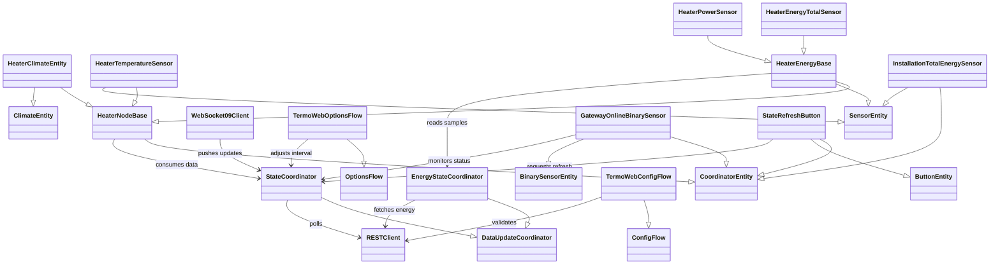

# HA-TermoWeb Architecture Overview

The TermoWeb integration bridges Home Assistant to the vendor cloud that supervises each household gateway and its attached field nodes—electric heaters (`htr`), heat-accumulating storage units (`acm`), power monitors (`pmo`), and thermostats (`thm`). The diagram and notes below summarise how credentials, polling, push updates, and energy history all flow through the integration.

## Component responsibilities

- **Config flow** – collects the user’s credentials/brand, instantiates a `RESTClient`, and verifies the account by calling `list_devices` before creating the config entry.【F:custom_components/termoweb/config_flow.py†L61-L132】
- **Config entry setup** – recreates the shared `RESTClient`, fetches the primary gateway and heater inventory, builds the `StateCoordinator`, wires up WebSocket clients, registers entities, and exposes the `import_energy_history` service.【F:custom_components/termoweb/__init__.py†L453-L670】
- **REST client** – `RESTClient` performs authenticated HTTP requests to enumerate devices, read heater settings, and push schedule/temperature updates back to the cloud API.【F:custom_components/termoweb/api.py†L269-L360】
- **Polling coordinator** – `StateCoordinator` periodically refreshes node state via the REST client and maintains cached per-device data that HA platforms consume.【F:custom_components/termoweb/coordinator.py†L22-L211】
- **Entities** – climate/sensor/binary-sensor/button entities subscribe to coordinator data and the dispatcher, then send writes through the shared REST client (e.g., updating schedules or presets) for the supported node types.【F:custom_components/termoweb/heater.py†L61-L136】【F:custom_components/termoweb/climate.py†L245-L420】
- **WebSocket client** – `WebSocket09Client` maintains the legacy Socket.IO session, folds push events into the coordinator cache, and dispatches targeted signals so entities update immediately while also feeding connection health back to setup logic.【F:custom_components/termoweb/ws_client.py†L40-L541】
- **Energy history importer** – the `import_energy_history` service gathers hourly energy counters via REST, rate-limits calls, and writes the resulting statistics into Home Assistant’s recorder database.【F:custom_components/termoweb/__init__.py†L160-L670】
- **TermoWeb cloud & hardware** – the documented API provides REST endpoints for device metadata, heater settings, and energy samples alongside a Socket.IO push channel, all representing the household gateway and heaters managed by the vendor backend.【F:docs/termoweb_api.md†L1-L176】

## Integration diagram

The flow shows how configuration and runtime components share the authenticated REST client, how polling and push updates keep entity state fresh, and how energy statistics are imported for the Recorder. The TermoWeb cloud in turn brokers communication with the household gateway that relays commands and telemetry for the attached heaters, accumulators, power monitors, and thermostats.【F:custom_components/termoweb/__init__.py†L453-L670】【F:custom_components/termoweb/ws_client.py†L40-L541】【F:docs/termoweb_api.md†L1-L176】

## Python class hierarchy

- **Client layer**
  - **RESTClient** – asynchronous REST wrapper that manages authentication, device discovery, heater settings, and sample retrieval for downstream coordinators and entities.【F:custom_components/termoweb/api.py†L48-L299】
- **Config flows**
  - **TermoWebConfigFlow** (`ConfigFlow`) – drives initial setup and reconfiguration, validating credentials through the shared client before creating entries.【F:custom_components/termoweb/config_flow.py†L77-L215】
  - **TermoWebOptionsFlow** (`OptionsFlow`) – exposes a lightweight options form that updates the polling interval on an existing entry.【F:custom_components/termoweb/config_flow.py†L218-L243】
- **Coordinators**
  - **StateCoordinator** (`DataUpdateCoordinator`) – polls heater metadata/settings for a gateway and caches it for all entity platforms.【F:custom_components/termoweb/coordinator.py†L22-L211】
  - **EnergyStateCoordinator** (`DataUpdateCoordinator`) – fetches heater energy and power samples, normalising counters for consumption sensors.【F:custom_components/termoweb/coordinator.py†L213-L304】
- **CoordinatorEntity derivatives**
  - **HeaterNodeBase** – common base for all heater-scoped entities, wiring coordinator data, websocket listeners, and device metadata.【F:custom_components/termoweb/heater.py†L61-L199】
    - **HeaterClimateEntity** (`ClimateEntity`) – exposes HVAC controls, schedule writes, and preset services for a single heater node.【F:custom_components/termoweb/climate.py†L112-L352】
    - **HeaterTemperatureSensor** (`SensorEntity`) – reports measured temperatures from a heater’s cached settings.【F:custom_components/termoweb/sensor.py†L164-L204】
    - **HeaterEnergyBase** (`SensorEntity`) – abstract base for heater power/energy metrics backed by the energy coordinator.【F:custom_components/termoweb/sensor.py†L206-L258】
      - **HeaterEnergyTotalSensor** – normalises cumulative energy readings to kWh for each heater.【F:custom_components/termoweb/sensor.py†L260-L269】
      - **HeaterPowerSensor** – provides instantaneous power estimates derived from energy deltas.【F:custom_components/termoweb/sensor.py†L272-L278】
  - **GatewayOnlineBinarySensor** (`BinarySensorEntity`) – publishes gateway connectivity by combining coordinator state with websocket status callbacks.【F:custom_components/termoweb/binary_sensor.py†L27-L95】
  - **StateRefreshButton** (`ButtonEntity`) – triggers immediate coordinator refreshes for the gateway device.【F:custom_components/termoweb/button.py†L18-L40】
  - **InstallationTotalEnergySensor** (`SensorEntity`) – aggregates heater energy metrics across the installation using the energy coordinator feed.【F:custom_components/termoweb/sensor.py†L281-L337】
- **Websocket client**
  - **WebSocket09Client** – socket.io client that streams push updates, maintains heartbeat loops, and dispatches payloads back into coordinator caches and dispatcher channels.【F:custom_components/termoweb/ws_client.py†L40-L195】

### Class relationships diagram

