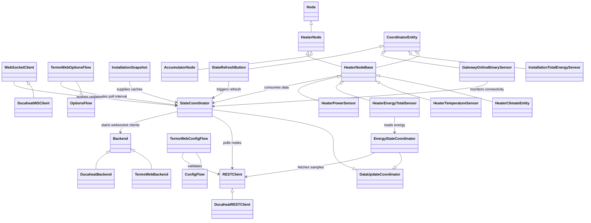

# HA-TermoWeb Architecture Overview

The TermoWeb integration links Home Assistant to both the TermoWeb and Ducaheat
deployments of the vendor cloud. Authentication, device discovery and write
operations flow through brand-specific REST clients, while push updates and
connection health are maintained through websocket clients that the backend
constructs for each gateway. Home Assistant maintains per-installation caches of
nodes, coordinates REST polling, merges websocket deltas, and exposes entity
state and energy statistics to the rest of the platform.【F:custom_components/termoweb/__init__.py†L140-L233】【F:custom_components/termoweb/backend/ws_client.py†L77-L193】【F:custom_components/termoweb/backend/ducaheat_ws.py†L188-L386】【F:custom_components/termoweb/energy.py†L421-L512】

## Key components

- **Config flow** – collects credentials, preferred brand and polling interval,
  instantiates a REST client for validation, and blocks entry creation until the
  remote account responds to a `list_devices` probe.【F:custom_components/termoweb/config_flow.py†L41-L177】
- **Config entry setup** – rebuilds the REST client, selects the appropriate
  backend implementation, snapshots the gateway and node inventory, prepares the
  `StateCoordinator`, and starts websocket clients before forwarding platforms
  and registering the energy import service.【F:custom_components/termoweb/__init__.py†L140-L233】
- **Backend abstractions** – the `Backend` interface exposes a shared HTTP
  client and a `create_ws_client` factory. `TermoWebBackend` reuses the unified
  websocket client, whereas `DucaheatBackend` injects an Engine.IO-compatible
  variant alongside the `DucaheatRESTClient` adapter that reshapes segmented API
  endpoints and websocket payloads.【F:custom_components/termoweb/backend/base.py†L11-L98】【F:custom_components/termoweb/backend/termoweb.py†L14-L69】【F:custom_components/termoweb/backend/ducaheat.py†L19-L190】【F:custom_components/termoweb/backend/ducaheat.py†L503-L529】
- **Node & installation helpers** – `nodes.py` normalises node identifiers and
  constructs `Node`/`HeaterNode` instances from raw payloads, while
  `InstallationSnapshot` caches derived metadata such as heater address maps,
  websocket subscription targets and canonicalised naming for reuse across
  coordinators, websocket handlers and services.【F:custom_components/termoweb/nodes.py†L112-L325】【F:custom_components/termoweb/installation.py†L20-L195】
- **Data coordinators** – `StateCoordinator` polls heater settings, maintains
  node caches and stretches polling intervals when websocket health is good,
  while `EnergyStateCoordinator` tracks address subscriptions, derives power
  deltas from hourly counters and suppresses REST polling when fresh websocket
  samples arrive.【F:custom_components/termoweb/coordinator.py†L93-L745】
- **Entity platforms** – `HeaterNodeBase` wires coordinator caches and
  dispatcher callbacks into climate and sensor entities; climate, temperature,
  energy and power entities extend this base to expose heater control and
  telemetry. Installation-wide aggregation, gateway connectivity monitoring and
  refresh buttons round out the platform coverage.【F:custom_components/termoweb/heater.py†L374-L520】【F:custom_components/termoweb/climate.py†L134-L220】【F:custom_components/termoweb/sensor.py†L156-L337】【F:custom_components/termoweb/sensor.py†L345-L421】【F:custom_components/termoweb/binary_sensor.py†L21-L99】【F:custom_components/termoweb/button.py†L21-L67】
- **Boost helpers** – Accumulator nodes surface a dedicated preset workflow:
  `HeaterClimateEntity` exposes `preset_modes` with a synthetic `boost` entry,
  `BoostDurationSelect` lets users configure the preferred runtime, helper
  buttons trigger or cancel a boost using canned durations, and binary/sensor
  entities reflect the active state and expected end time.【F:custom_components/termoweb/climate.py†L982-L1269】【F:custom_components/termoweb/select.py†L29-L219】【F:custom_components/termoweb/button.py†L39-L296】【F:custom_components/termoweb/binary_sensor.py†L42-L99】【F:custom_components/termoweb/sensor.py†L146-L461】
- **Websocket layer** – `WebSocketClient` negotiates the correct Socket.IO or
  Engine.IO handshake, keeps per-device health metrics, updates coordinator
  caches, and broadcasts dispatcher signals. `DucaheatWSClient` layers brand-
  specific logging atop the shared implementation.【F:custom_components/termoweb/backend/ws_client.py†L40-L193】【F:custom_components/termoweb/backend/ducaheat_ws.py†L188-L386】
- **Energy services** – the energy helper enforces a shared rate limiter for
  historical sample queries, performs targeted imports based on entity
  selection, and registers the `import_energy_history` service only once per
  Home Assistant instance.【F:custom_components/termoweb/energy.py†L142-L178】【F:custom_components/termoweb/energy.py†L314-L733】【F:custom_components/termoweb/energy.py†L735-L846】

## Runtime data flow


### Boost control flow


**Front-end entities**

- `climate.termoweb_*` exposes `preset_mode: boost` alongside the standard HVAC
  modes. Switching to this preset calls `termoweb.start_boost` with the cached
  default runtime.【F:custom_components/termoweb/climate.py†L982-L1269】
- `select.termoweb_*_boost_duration` provides curated runtime options (1–120
  minutes) that keep the cached preset synchronised with `/setup` writes.【F:custom_components/termoweb/select.py†L29-L219】
- `button.termoweb_*_boost_minutes_*` and
  `button.termoweb_*_boost_cancel` offer one-tap start/stop helpers that use the
  same validation routines as the services.【F:custom_components/termoweb/button.py†L39-L296】
- `binary_sensor.termoweb_*_boost_active`,
  `sensor.termoweb_*_boost_minutes_remaining`, and
  `sensor.termoweb_*_boost_end` mirror the coordinator cache so dashboards have
  instantaneous feedback while REST calls propagate.【F:custom_components/termoweb/binary_sensor.py†L42-L99】【F:custom_components/termoweb/sensor.py†L146-L461】

**Backend processing**

1. User interactions call one of the `termoweb.*` helper services.【F:custom_components/termoweb/services.yaml†L53-L100】
2. The climate entity or helper button validates duration limits (1–120 minutes)
   before delegating to the shared coordinator logic.【F:custom_components/termoweb/climate.py†L1116-L1177】【F:custom_components/termoweb/button.py†L226-L296】
3. `StateCoordinator` performs an optimistic local update and asks the REST
   client to POST to either `/status` (`boost` toggles) or `/setup`
   (`extra_options.boost_time`, `extra_options.boost_temp`).【F:custom_components/termoweb/climate.py†L1189-L1269】【F:custom_components/termoweb/api.py†L561-L661】
4. Responses update the boost runtime cache, which fans out to the select
   entity and sensors so Lovelace stays in sync with the backend.【F:custom_components/termoweb/__init__.py†L254-L260】【F:custom_components/termoweb/select.py†L166-L219】【F:custom_components/termoweb/sensor.py†L321-L367】

### Example Lovelace stack

```yaml
type: vertical-stack
cards:
  - type: thermostat
    entity: climate.living_room_accumulator
    name: Living room accumulator
  - type: tile
    entity: select.living_room_accumulator_boost_duration
    name: Boost tools
    state_content: current_option
    chips:
      - type: entity
        entity: binary_sensor.living_room_accumulator_boost_active
        name: Boosting
      - type: template
        content: >-
          {{ states('sensor.living_room_accumulator_boost_minutes_remaining') }} min
        icon: mdi:timer-outline
      - type: entity
        entity: sensor.living_room_accumulator_boost_end
        name: Ends
      - type: service
        service: termoweb.start_boost
        data:
          entity_id: climate.living_room_accumulator
        name: Start boost
        icon: mdi:fire
      - type: service
        service: termoweb.cancel_boost
        data:
          entity_id: climate.living_room_accumulator
        name: Cancel
        icon: mdi:stop-circle-outline
```

The stack keeps climate control centred on the thermostat card, mirrors the
real-time boost state, and exposes single-tap start/stop actions that call the
validated helper services. The tile’s state reflects the configured preset
duration so users can confirm the runtime before triggering a boost.

## Python class hierarchy

- **Backend & HTTP layer**
  - `RESTClient` provides authenticated REST helpers shared by both brands, with
    `DucaheatRESTClient` overriding segmented endpoints.【F:custom_components/termoweb/api.py†L37-L144】【F:custom_components/termoweb/backend/ducaheat.py†L19-L190】
  - `Backend` defines the interface Home Assistant uses to request websocket
    clients, implemented by `TermoWebBackend` and `DucaheatBackend`.【F:custom_components/termoweb/backend/base.py†L69-L98】【F:custom_components/termoweb/backend/termoweb.py†L14-L69】【F:custom_components/termoweb/backend/ducaheat.py†L503-L523】
- **Config flows**
  - `TermoWebConfigFlow` and `TermoWebOptionsFlow` handle initial setup and
    reconfiguration while reusing the shared login workflow.【F:custom_components/termoweb/config_flow.py†L71-L243】
- **Installation & node modelling**
  - `Node`, `HeaterNode`, `AccumulatorNode` and helpers build canonical node
    inventories. `InstallationSnapshot` caches derived structures (address maps,
    subscription targets, explicit names).【F:custom_components/termoweb/nodes.py†L112-L325】【F:custom_components/termoweb/installation.py†L20-L195】
- **Coordinators**
  - `StateCoordinator` manages REST polling, pending write expectations and
    websocket-driven poll throttling. `EnergyStateCoordinator` tracks energy
    counters and power derivations per address.【F:custom_components/termoweb/coordinator.py†L93-L915】
- **Entity mixins & platforms**
  - `HeaterNodeBase` underpins climate and sensor entities, while
    `HeaterClimateEntity`, `HeaterTemperatureSensor`, `HeaterEnergyTotalSensor`,
    `HeaterPowerSensor`, `InstallationTotalEnergySensor`,
    `GatewayOnlineBinarySensor`, and `StateRefreshButton` expose heater control,
    telemetry and maintenance helpers to Home Assistant.【F:custom_components/termoweb/heater.py†L374-L520】【F:custom_components/termoweb/climate.py†L134-L220】【F:custom_components/termoweb/sensor.py†L156-L421】【F:custom_components/termoweb/binary_sensor.py†L21-L99】【F:custom_components/termoweb/button.py†L21-L67】
- **Websocket clients**
  - `WebSocketClient` encapsulates connection management, dispatcher integration
    and health tracking; `DucaheatWSClient` extends it with brand-specific
    diagnostics.【F:custom_components/termoweb/ws_client.py†L40-L104】【F:custom_components/termoweb/ws_client.py†L760-L833】【F:custom_components/termoweb/ws_client.py†L1856-L1896】
- **Energy import services**
  - Helper functions manage rate limiting, targeted imports and the public
    `import_energy_history` service for historical statistics.【F:custom_components/termoweb/energy.py†L150-L177】【F:custom_components/termoweb/energy.py†L421-L919】

### Class relationships diagram


